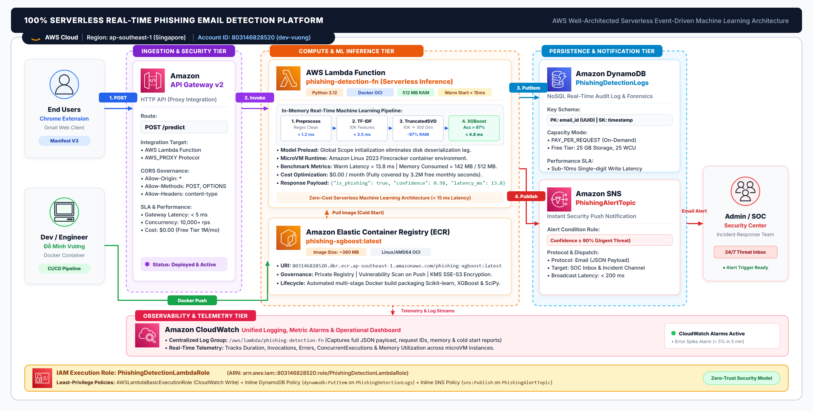

# AWS Serverless Real-time Phishing Detection & Alert System 🛡️

[](https://aws.amazon.com/)
[](https://aws.amazon.com/lambda/)
[](https://aws.amazon.com/api-gateway/)
[](https://aws.amazon.com/dynamodb/)
[](https://aws.amazon.com/sns/)
[](https://www.python.org/)
[](https://xgboost.readthedocs.io/)
[](https://developer.chrome.com/docs/extensions/)
[](LICENSE)

Hệ thống phát hiện thư điện tử lừa đảo (Phishing & Spam) theo thời gian thực ứng dụng **100% Kiến trúc không máy chủ (Serverless Architecture)** trên nền tảng **Amazon Web Services (AWS)** kết hợp với tiện ích mở rộng **Google Chrome Extension (Manifest V3)** nhúng trực tiếp vào giao diện web của **Gmail**.

---

## 📌 Điểm nổi bật của dự án

- **Kiến trúc 100% Serverless**: Không tốn chi phí duy trì máy chủ, tự động co giãn theo lưu lượng truy cập (Auto-scaling), chi phí vận hành **$0.00 / tháng** (trong hạn mức AWS Free Tier).
- **Độ trễ siêu thấp**: Tải mô hình vào Global Memory giúp các lần gọi sau (Warm Start) đạt tốc độ suy luận dưới **15 ms**, tổng thời gian từ Gmail đến khi có cảnh báo dưới **300 ms**.
- **Containerized ML Deployment**: Đóng gói môi trường Python 3.12 và các thư viện C-extension (`xgboost`, `scikit-learn`, `joblib`) vào **Docker Image** lưu trữ tại **Amazon ECR**, vượt qua giới hạn 250 MB của Lambda zip truyền thống.
- **Audit Logging & Incident Alerting**: Tự động lưu nhật ký phân tích vào **Amazon DynamoDB** và kích hoạt thông báo khẩn cấp qua **Amazon SNS** tới email của quản trị viên khi phát hiện rủi ro $\ge 90\%$.
- **Trải nghiệm Client liền mạch**: Tiện ích Chrome Extension dùng `MutationObserver` tự động gắn nút quét thông minh và Security Banner 3 cấp độ cảnh báo (An toàn, Cần lưu ý, Nguy hiểm) ngay trên giao diện đọc thư Gmail.

---

## 🏛️ Sơ đồ kiến trúc tổng thể (System Architecture)



### Luồng xử lý dữ liệu (Data Flow):
```
[ Gmail Client / Chrome Extension ]
                 │ (1. HTTPS POST /predict)
                 ▼
      [ Amazon API Gateway v2 ]
                 │ (2. Proxy Event Trigger)
                 ▼
          [ AWS Lambda ] ◄── Pull Image ── [ Amazon ECR ]
    (XGBoost + SVD + Regex)
         │               │
 (3. Log Audit)   (4. Alert nếu rủi ro ≥ 90%)
         ▼               ▼
[ Amazon DynamoDB ]   [ Amazon SNS ] ──► (Email cảnh báo Admin)
         │
         ▼
[ Amazon CloudWatch ] (Thu thập Logs, Metrics, Latency & RAM)
```

---

## 🛠️ Danh mục dịch vụ AWS sử dụng

| Dịch vụ AWS | Loại dịch vụ | Nhiệm vụ chính trong dự án | Cấu hình tối ưu |
| :--- | :--- | :--- | :--- |
| **AWS Lambda** | Serverless Compute | Bộ não tính toán trung tâm chạy hàm suy luận mô hình XGBoost | 512 MB RAM, Timeout 5s, Python 3.12 Image |
| **Amazon API Gateway v2** | Ingestion & Ingress | Tiếp nhận request HTTPS từ Internet, cấu hình CORS, kích hoạt Lambda | HTTP API v2, Route `POST /predict` |
| **Amazon ECR** | Container Registry | Lưu trữ Docker Image chứa Python runtime, thư viện ML và trọng số mô hình | Private Repository `phishing-xgboost` |
| **Amazon DynamoDB** | Serverless NoSQL | Lưu trữ nhật ký kiểm toán (Audit Logs) thời gian thực của các request | Table `PhishingDetectionLogs`, Provisioned (1 RCU / 1 WCU) |
| **Amazon SNS** | Pub/Sub Messaging | Phát thông điệp cảnh báo sự cố khẩn cấp tới email của Admin | Topic `PhishingAlertTopic`, Email Subscription |
| **Amazon CloudWatch** | Observability | Thu thập nhật ký Log Stream, theo dõi độ trễ, mức RAM tiêu thụ | Log Group `/aws/lambda/PhishingDetectionXGBoostContainer` |
| **AWS IAM** | Security & Access | Phân quyền truy cập theo nguyên tắc đặc quyền tối thiểu (Least Privilege) | Role `PhishingDetectionLambdaRole` |

---

## 📂 Cấu trúc Repository

```text
AWS-Serverless-Phishing-Detection/
│
├── aws_serverless/                # PHÂN HỆ BACKEND & SERVERLESS INFRASTRUCTURE
│   ├── Dockerfile                 # Đóng gói Container Image cho AWS Lambda (Amazon Linux 2023)
│   ├── requirements.txt           # Danh mục thư viện Python (scikit-learn, xgboost, joblib, boto3)
│   ├── lambda_function.py         # AWS Lambda Handler (Tiền xử lý, Inference, DynamoDB log, SNS alert)
│   ├── deploy_aws.py              # Script tự động triển khai toàn bộ hạ tầng AWS bằng Boto3
│   ├── build_package.py           # Script tự động đóng gói file zip triển khai
│   ├── test_local.py              # Kiểm thử offline pipeline mô phỏng Lambda trên máy local
│   ├── test_api.py                # Kiểm thử trực tiếp Endpoint API Gateway sau triển khai
│   └── README.md                  # Hướng dẫn chi tiết triển khai & test backend
│
├── gmail_extension/               # PHÂN HỆ FRONTEND CLIENT (CHROME EXTENSION V3)
│   ├── manifest.json              # Khai báo Chrome Extension Manifest V3
│   ├── content.js                 # MutationObserver gắn nút quét & Security Banner trên Gmail
│   ├── background.js              # Service worker xử lý gọi API nền
│   ├── popup.html                 # Giao diện popup tiện ích kiểm tra nhanh
│   ├── popup.js                   # Logic điều khiển popup
│   ├── styles.css                 # Giao diện Flat Material chuẩn Gmail cho banner & popup
│   ├── icons/                     # Bộ biểu tượng các kích thước (16, 48, 128)
│   └── README.md                  # Hướng dẫn nạp tiện ích và kiểm thử trên Gmail
│
├── models/                        # MÔ HÌNH HỌC MÁY (MACHINE LEARNING WEIGHTS)
│   ├── hybrid_tfidf_vectorizer.joblib  # Bộ trích xuất đặc trưng TF-IDF (~738 KB)
│   ├── hybrid_svd_model.joblib         # Bộ giảm chiều không gian Truncated SVD (~34.3 MB)
│   ├── hybrid_xgboost_dense.joblib     # Trọng số mô hình XGBoost phân loại (~1.18 MB)
│   └── README.md                       # Thông số kỹ thuật của mô hình
│
├── docs/                          # TÀI LIỆU & SƠ ĐỒ HỆ THỐNG
│   ├── serverless-system-architecture.png
│   ├── serverless-system-architecture.svg
│   └── phishing-detection-dataflow.png
│
├── .gitignore                     # Bỏ qua file rác, file tạm, cache
└── README.md                      # Tài liệu tổng quan dự án
```

---

## 🤖 Pipeline Machine Learning

Mô hình phân loại văn bản được cấu hình tuần tự theo pipeline:
1. **Tiền xử lý Regex (`preprocess_hybrid_text`)**:
   - Chuẩn hóa chữ thường (lowercase).
   - Thay thế địa chỉ email thành token `tagemail`.
   - Thay thế liên kết URL thành token `tagurl`.
   - Giữ lại bảng chữ cái tiếng Việt có dấu, chữ số và khoảng trắng; lọc toàn bộ ký tự đặc biệt gây nhiễu.
2. **Trích xuất đặc trưng TF-IDF (`hybrid_tfidf_vectorizer.joblib`)**:
   - Phân tích n-gram cấp độ từ (word n-grams) và ký tự (character n-grams), tạo ma trận thưa biểu diễn ngữ cảnh văn bản.
3. **Giảm chiều không gian Truncated SVD (`hybrid_svd_model.joblib`)**:
   - Áp dụng thuật toán Latent Semantic Analysis (LSA) giảm số chiều xuống vector đặc (dense vector) 300 chiều, giúp tối ưu bộ nhớ RAM và tăng tốc suy luận.
4. **Dự đoán qua mô hình XGBoost (`hybrid_xgboost_dense.joblib`)**:
   - Thuật toán cây quyết định tăng cường gradient (Gradient Boosted Trees) tính toán xác suất lừa đảo $P \in [0, 1]$.
   - Ngưỡng phân loại:
     - $P < 50\%$: **An toàn (Safe)**
     - $50\% \le P < 75\%$: **Cần lưu ý / Tiếp thị (Suspicious)**
     - $P \ge 75\%$: **Cảnh báo lừa đảo nguy hiểm (Phishing Alert)**
     - $P \ge 90\%$: Kích hoạt cảnh báo tự động gửi email cho Admin qua Amazon SNS.

---

## 🚀 Hướng dẫn cài đặt & Triển khai

### 1. Điều kiện tiên quyết (Prerequisites)
- Tài khoản AWS (hoạt động tốt trong phạm vi Free Tier).
- Máy tính đã cài đặt: [AWS CLI v2](https://aws.amazon.com/cli/), [Python 3.12](https://www.python.org/), [Docker Desktop](https://www.docker.com/).
- Cấu hình AWS CLI với quyền truy cập:
  ```bash
  aws configure
  ```

### 2. Triển khai Backend lên AWS

#### Phương án A: Tự động hóa bằng Script Python (`deploy_aws.py`)
```bash
cd aws_serverless
pip install boto3
python deploy_aws.py
```
Script sẽ tự động:
1. Khởi tạo bảng DynamoDB `PhishingDetectionLogs`.
2. Khởi tạo Amazon SNS Topic `PhishingAlertTopic`.
3. Tạo IAM Role và cấp chính sách quyền Least Privilege.
4. Triển khai AWS Lambda và cấu hình HTTP API Gateway v2 kèm CORS.

#### Phương án B: Đóng gói và đẩy Container Image lên Amazon ECR
```bash
cd aws_serverless

# 1. Đăng nhập vào Amazon ECR
aws ecr get-login-password --region ap-southeast-1 | docker login --username AWS --password-stdin <YOUR_ACCOUNT_ID>.dkr.ecr.ap-southeast-1.amazonaws.com

# 2. Xây dựng Docker Image
docker build -t phishing-xgboost .

# 3. Gắn tag và đẩy lên ECR
docker tag phishing-xgboost:latest <YOUR_ACCOUNT_ID>.dkr.ecr.ap-southeast-1.amazonaws.com/phishing-xgboost:latest
docker push <YOUR_ACCOUNT_ID>.dkr.ecr.ap-southeast-1.amazonaws.com/phishing-xgboost:latest

# 4. Tạo hoặc cập nhật Lambda Function từ Image ECR
aws lambda create-function \
    --function-name PhishingDetectionXGBoostContainer \
    --package-type Image \
    --code ImageUri=<YOUR_ACCOUNT_ID>.dkr.ecr.ap-southeast-1.amazonaws.com/phishing-xgboost:latest \
    --role <YOUR_LAMBDA_ROLE_ARN> \
    --timeout 5 \
    --memory-size 512
```

### 3. Cài đặt Chrome Extension vào trình duyệt
1. Mở trình duyệt Google Chrome (hoặc Microsoft Edge, Brave).
2. Truy cập vào trang quản lý tiện ích: `chrome://extensions/`.
3. Bật công tắc **Developer mode** (Chế độ dành cho nhà phát triển) ở góc trên bên phải.
4. Nhấn nút **Load unpacked** (Tải tiện ích đã giải nén) và chọn thư mục:
   ```text
   AWS-Serverless-Phishing-Detection/gmail_extension
   ```
5. Tiện ích **Gmail Phishing Detector - AI Serverless** sẽ xuất hiện trên thanh công cụ của trình duyệt.

---

## 🧪 Kiểm thử hệ thống (Testing)

### 1. Kiểm thử ngoại tuyến mô phỏng Lambda (Offline Test)
```bash
cd aws_serverless
pip install scikit-learn xgboost joblib
python test_local.py
```

### 2. Kiểm thử Endpoint API Gateway (Live Endpoint Test)
```bash
curl -X POST https://<your-api-id>.execute-api.ap-southeast-1.amazonaws.com/predict \
     -H "Content-Type: application/json" \
     -d "{\"text\": \"THÔNG BÁO KHẨN: Tài khoản ngân hàng của bạn bị tạm khóa. Vui lòng đăng nhập tại http://fake-bank-login.com để xác minh.\"}"
```

Kết quả phản hồi JSON chuẩn:
```json
{
  "label": "phishing",
  "confidence": 0.9854,
  "risk_level": "CRITICAL_DANGER",
  "latency_ms": 12.35,
  "request_id": "9b1deb4d-3b7d-4bad-9bdd-2b0d7b3dcb6d",
  "audit_logged": true,
  "alert_sent": true
}
```

### 3. Kiểm thử trực tiếp trên giao diện Gmail
1. Đăng nhập [Gmail](https://mail.google.com/).
2. Mở một email bất kỳ.
3. Nút **`🛡️ Kiểm tra Phishing (AI)`** sẽ tự động hiển thị trên thanh công cụ email.
4. Bấm kiểm tra để xem thanh Security Banner phân loại an toàn/nguy hiểm theo thời gian thực.

---

## 🧹 Dọn dẹp tài nguyên (Clean-up)

Để tránh phát sinh chi phí ngoài ý muốn sau khi hoàn thành đánh giá hoặc thuyết trình:

```bash
# 1. Xóa API Gateway
aws apigatewayv2 delete-api --api-id <YOUR_API_ID>

# 2. Xóa Lambda Function
aws lambda delete-function --function-name PhishingDetectionXGBoostContainer

# 3. Xóa ECR Repository và Images
aws ecr delete-repository --repository-name phishing-xgboost --force

# 4. Xóa DynamoDB Table
aws dynamodb delete-table --table-name PhishingDetectionLogs

# 5. Xóa SNS Topic
aws sns delete-topic --topic-arn <YOUR_SNS_TOPIC_ARN>

# 6. Xóa IAM Role
aws iam delete-role --role-name LambdaPhishingXGBoostExecutionRole
```

---

## 👤 Tác giả & Thông tin đồ án

* **Sinh viên thực hiện:** Đỗ Minh Vương
* **Đề tài:** Hệ thống Serverless phát hiện thư điện tử lừa đảo và tin nhắn rác theo thời gian thực trên AWS
* **Chương trình:** Báo cáo Thực tập Tốt nghiệp (FCAJ Workforce Bootcamp / Cloud Computing)
* **Khu vực triển khai:** `ap-southeast-1` (Singapore)
